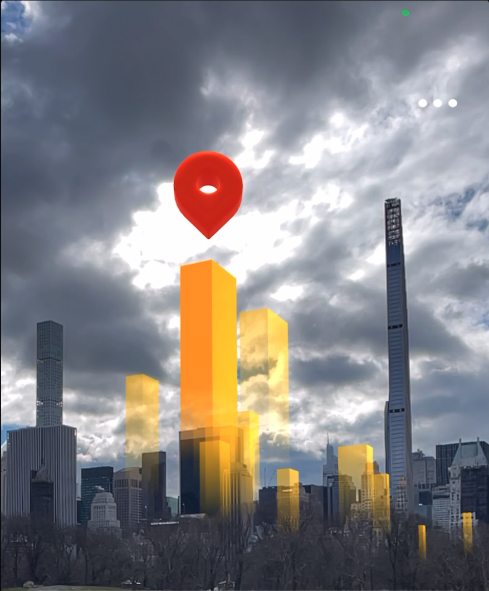

# SkyLine

SkyLine is an augmented reality app that shows the progression of the skyline in New York City over the next 10 years or so. The app displays proposed highrises in their correct locations, superimposed on existing buildings, and provides a glimpse into the future of the city's architecture. 

The project was completed as part of the AR Core Geospatial API Hackathon, and was awarded second place overall. To learn more, see checkout the project page in [my portfolio](https://www.samstrong.design/skyline)
